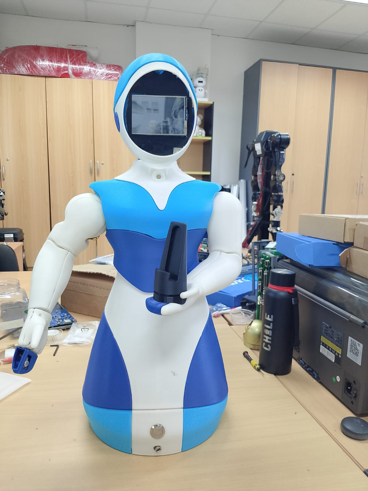
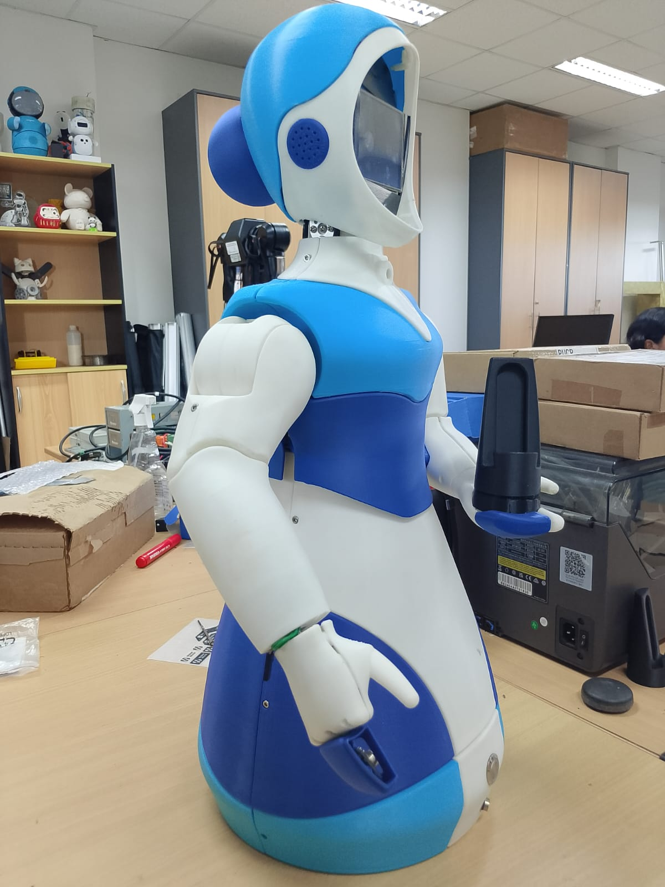

# MiniQhali - Robot Social de Asistencia Médica 🤖🏥

<table align="center">
  <tr>
    <td align="center">
      
      <br>
      <sup><b>MiniQhali Front View</b></sup>
    </td>
    <td align="center">
      
      <br>
      <sup><b>MiniQhali Side View</b></sup>
    </td>
  </tr>
</table>

Este proyecto integra un sistema de **sensores biomédicos (IoT)** con una **interfaz robótica web (Flask)** y un sistema de **gestión de pacientes (MySQL)**. El robot "MiniQhali" visualiza el estado de salud del paciente mediante expresiones faciales animadas y permite el registro, monitoreo y almacenamiento histórico de consultas médicas.

## 📂 Estructura del Proyecto

El proyecto está organizado de manera modular para separar la lógica del servidor, la interfaz visual y la lectura de sensores:

```text
/MiniQhali_Project
│
├── /web_interface           # SERVIDOR FLASK (Frontend y Backend Web)
│   ├── /public              # Archivos estáticos (HTML, CSS, JS)
│   │   ├── /face            # Interfaz de la Cara del Robot (Animaciones)
│   │   ├── /mobile          # Interfaz de Recolección de Datos (Médico)
│   │   └── /monitoring      # Dashboard de Historial e información general de Pacientes
|   |      └── /details      # Detalles del paciente seleccionado en la página de monitoring
│   └── server.py            # Cerebro principal: Rutas, Socket.IO y Conexión a BD
│
├── /src                     # LÓGICA DE SENSORES (Hardware)
│   └── /health_system
│       ├── vital_signs_reading.py       # Lee sensores físicos vía Serial (USB)
│       ├── vital_signs_reading_mqtt.py  # (Opcional) Lee sensores vía WiFi/MQTT
│       ├── send_data_http.py            # Puente HTTP para enviar datos a Flask
│       └── datos_medicos.json           # Archivo temporal de intercambio
│
│── README.md
├── requirements.txt
└── run_miniqhali.sh         # Script maestro de arranque automático (Bash)
```

## 🖥️ Módulos del Sistema

El sistema consta de tres interfaces web principales conectadas entre sí:

### 1. 📱 Mobile Interface (`/mobile`)
**Función:** Panel de control para el personal médico.
* **Uso:** El médico ingresa los datos del paciente y visualiza la lectura de sensores paso a paso (BPM, SpO2, Temperatura).
* **Flujo de Datos:**
    1. Recibe datos en tiempo real de los sensores vía WebSockets.
    2. Al finalizar la recolección, calcula promedios y diagnósticos.
    3. Envía la información final a la **Base de Datos** y notifica a la cara del robot.

### 2. 🤖 Robot Face (`/`)
**Función:** Interfaz visual del robot.
* **Uso:** Se visualiza en la pantalla principal del robot.
* **Comportamiento:**
    * **Modo Vivo:** Reacciona en tiempo real a los cambios de los sensores (ej. se pone rojo si detecta fiebre momentánea).
    * **Modo Resultado:** Cuando la interfaz *Mobile* finaliza el chequeo, la cara se bloquea mostrando la emoción correspondiente al diagnóstico final del paciente.

### 3. 📊 Monitoring & Details (`/monitoring`)
**Función:** Dashboard administrativo y de historial.
* **Monitoring:** Muestra una lista paginada de todos los pacientes registrados en la base de datos, con búsqueda por nombre.
* **Details:** Al seleccionar un paciente, carga una vista detallada con sus datos personales, diagnósticos y **gráficos históricos** generados durante su consulta.

---

## ⚙️ Instalación y Requisitos

Asegúrate de tener Python 3 instalado en tu sistema. Antes de iniciar, instala las librerías necesarias ejecutando:

```bash
pip install -r requirements.txt
```

---

## 🚀 Guía de Ejecución Rápida

Para facilitar el despliegue, el proyecto incluye un script de automatización que levanta el servidor web, la lectura de sensores y el envío de datos simultáneamente.

### 1. Dar permisos de ejecución
Solo es necesario la primera vez. Abre una terminal en la raíz del proyecto y escribe:

```bash
chmod +x run_miniqhali.sh
```

### 2. Iniciar el Sistema
Ejecuta el script maestro:

```bash
./run_miniqhali.sh
```

**Lo que sucederá:**
1. Se iniciará el **Servidor Flask** en segundo plano.
2. Arrancará la **Lectura de Sensores** (generación de datos).
3. Se activará el **Puente HTTP** para enviar los datos a la web.

> **Visualización:** Una vez corriendo, abre tu navegador en: `http://localhost:3000`

### 🛑 Detener el sistema
Para apagar todos los procesos de forma segura, simplemente presiona `Ctrl + C` en la terminal donde corre el script.

---

## 📡 Configuración Avanzada: Modo MQTT

Por defecto, el sistema ejecuta `vital_signs_reading.py` para leer sensores directamente vía Serial/USB. Si deseas utilizar una arquitectura distribuida (ej. sensores en un ESP32 enviando datos a un broker MQTT vía WiFi), sigue estos pasos previos.

### 1. Instalar y Habilitar Mosquitto
Si estás ejecutando el servidor en Linux o Raspberry Pi, necesitas instalar el broker MQTT y asegurarte de que esté activo:

```bash
sudo apt update
sudo apt install mosquitto mosquitto-clients -y
sudo systemctl enable mosquitto
sudo systemctl start mosquitto
```

### 2. Configurar el ESP32
El microcontrolador necesita saber la dirección IP de este servidor para enviar los datos. Ambos dispositivos deben encontrarse conectados a la misma red.

1.  **Obtener IP del Servidor:** En la terminal de este equipo, ejecuta:
    ```bash
    hostname -I
    ```
    *(Copia la primera dirección IP que aparezca, ej: `192.168.1.XX`)*.

2.  **Actualizar Firmware:** Dirígete al repositorio donde se encuentra el código del ESP32.
3.  **Editar Código:** Busca la variable `MQTT_SERVER` o `BROKER_IP` y pega la IP que obtuviste en el paso anterior.
4.  **Cargar:** Sube el programa actualizado a tu placa ESP32.

### 3. Configurar el Script de Arranque
Finalmente, dile a MiniQhali que use el script de recepción MQTT en lugar de la lectura serial.

1.  Abre el archivo `run_miniqhali.sh` con un editor de texto.
2.  Busca la sección de ejecución de sensores.
3.  Cambia la línea de la **Opción A** y por la línea de la **Opción B**:

```bash
# --- DENTRO DE run_miniqhali.sh ---

# OPCIÓN A: Comunicación Serial (Default)
# python3 src/health_system/vital_signs_reading.py &        <-- CAMBIAR ESTA

# OPCIÓN B: Receptor MQTT (Usar si tienes Mosquitto corriendo)
python3 src/health_system/vital_signs_reading_mqtt.py &     <-- POR ESTA
```

4.  Guarda el archivo.

### 4. Ejecutar el Sistema
Reinicia el sistema con el script maestro. Ahora escuchará los datos que lleguen por la red:

```bash
./run_miniqhali.sh
```

---

## 🧠 Lógica de Expresiones (Estados)

El servidor analiza la temperatura y la saturación de oxígeno para cambiar la "emoción" del robot automáticamente.

| Estado (Flag) | Color Cara | Condición Médica | Descripción |
| :---: | :--- | :--- | :--- |
| **0** | ⚫ **Normal** | Signos estables | Paciente en rango saludable. |
| **1** | 🔴 **Rojo** | Fiebre | Temperatura corporal **> 37.5°C**. |
| **2** | 🔵 **Azul** | Hipotermia | Temperatura corporal **< 35.0°C**. |
| **3** | 🟢 **Verde** | Hipoxia | Saturación de oxígeno (SpO2) **< 90%**. |
